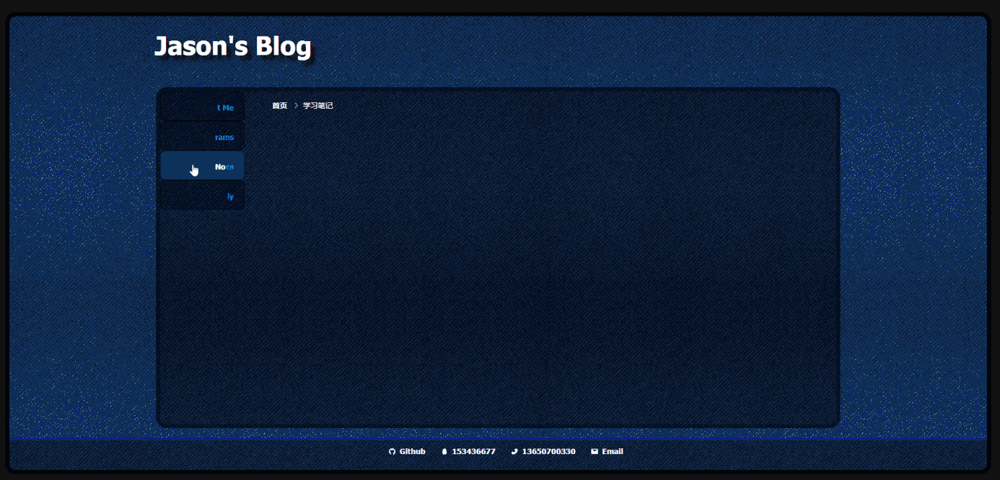
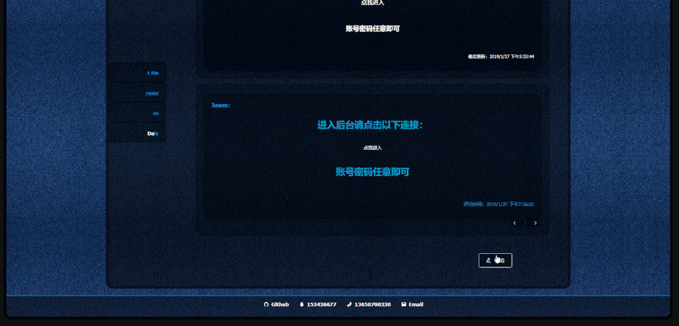
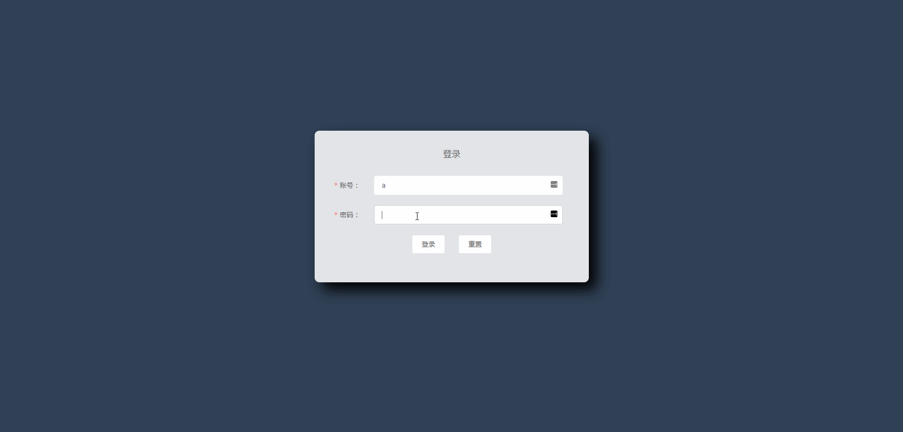

# Demo for a Vue-base blog


### 简介：
>   这个demo是本人学习完vue系列相关知识后作为练手项目完成的。Demo做得比较简单，之后会陆续进行优化。


#### 前台展示：




#### 中后台展示：


主要用到：
* Vue
* Vuex
* Vue-router
* Vue2Editor
* Element
* Scss
* Normalize.css
* Axios
* Json-server


### Demo介绍：

&emsp;&emsp;目前程序数据的存储仅仅是保存在一个JSON文件里，再通过json-server搭建的临时服务器提供数据的提交及获取，并不具备真正的数据库功能，暂时用于演示功能。

&emsp;&emsp;Demo分成了前台和后台两个部分。虽然结构上是共用一个store，但已经为store中各自对应的部分分割成了不同的modules，可以按需引入；并且前后台两个部分不要求部署在同一个域中，可以分开部署；前台展示区的代码中也没有暴露跟后台有关的信息，只要两部分能连接到数据库就可以实行前台展示与后台管理两个功能部分的分离。

&emsp;&emsp;富文本编辑器使用了vue官方资源推荐中的vue2editor，功能比较单一，也不支持markdown语法，之后物色到有更好的编辑器会考虑进行替换。编辑器本身有对富文本提交的数据有做过滤处理，另外我在将数据提交到数据库前也进行了转码操作，xss的风险应该是比较低的。

&emsp;&emsp;前台的风格是本人设计的，用半透明的背景框包裹内容，配合element内置的过渡特效，让操作和视觉更有质感。前台边栏的标签及对应的分类可以在后台进行添加、修改及删除。在博文的详情页中可以点击底部的评论按钮打开编辑器进行回复。由于暂时没有完成注册功能，因此不要求访客必须注册才能发言，只要在编辑器中输入访客名和内容即可评论。

&emsp;&emsp;后台的UI虽然是有参考网络上的后台ui库，但没有使用如vue-admin等的ui库，都是本人用element实现的。由于没有真正的数据库和服务器，因此暂时用于测试用途，任意用户名和密码即可登录。后台提供的功能如下：

* 分类的添加、编辑、删除
* 分类页提供跳转到对应分类下的博文页列表
* 博文列表按时间排序和根据分类作筛选
* 博文的修改、发布及删除
* 博文列表页跳转到博文详情页
* 评论列表按时间排序
* 评论的修改和删除
* 评论列表页跳转到博文详情页，并根据锚点滑动到对应评论项和高亮显示目标评论
* 列表页提供分页功能


### 感谢
&emsp;&emsp;如果您看到这个部分，首先我很感谢能认真看完篇介绍，功能方面可以尝试体验下，另外在博客的首页上有本人的一些个人信息及过去的工作经历，如果有需要的话可以根据以下途径联系本人，谢谢！

```
phone : 13650700330
email : Jason.But@yahoo.com
QQ    : 153436677
```

[踩坑记录](./UPDATE.md)
